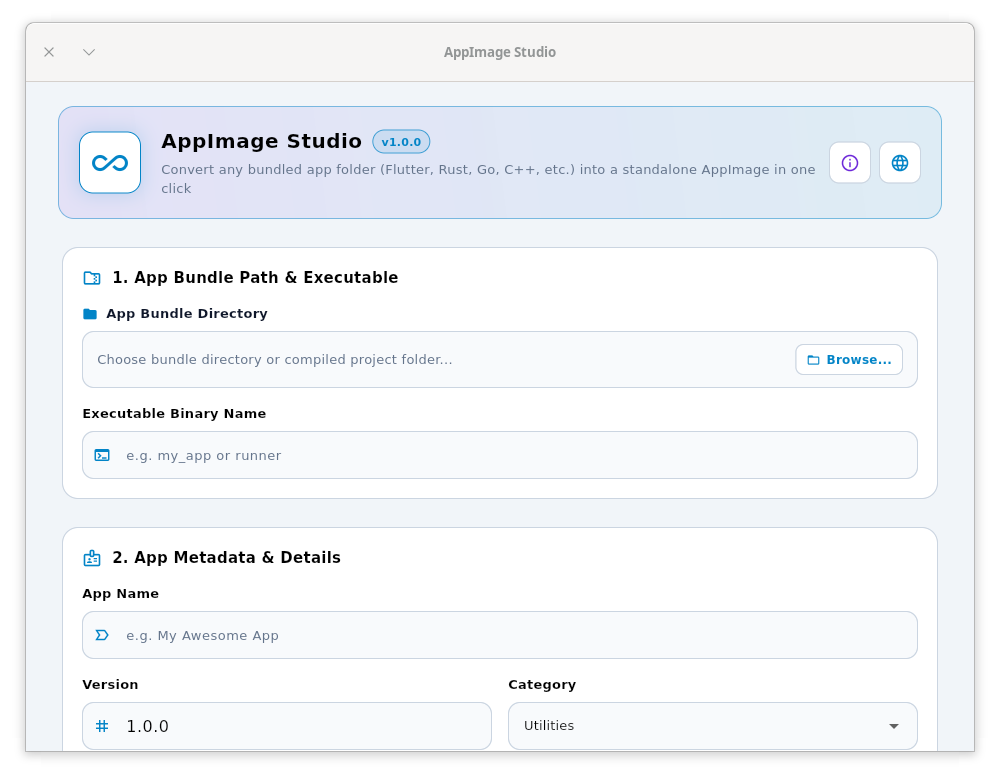
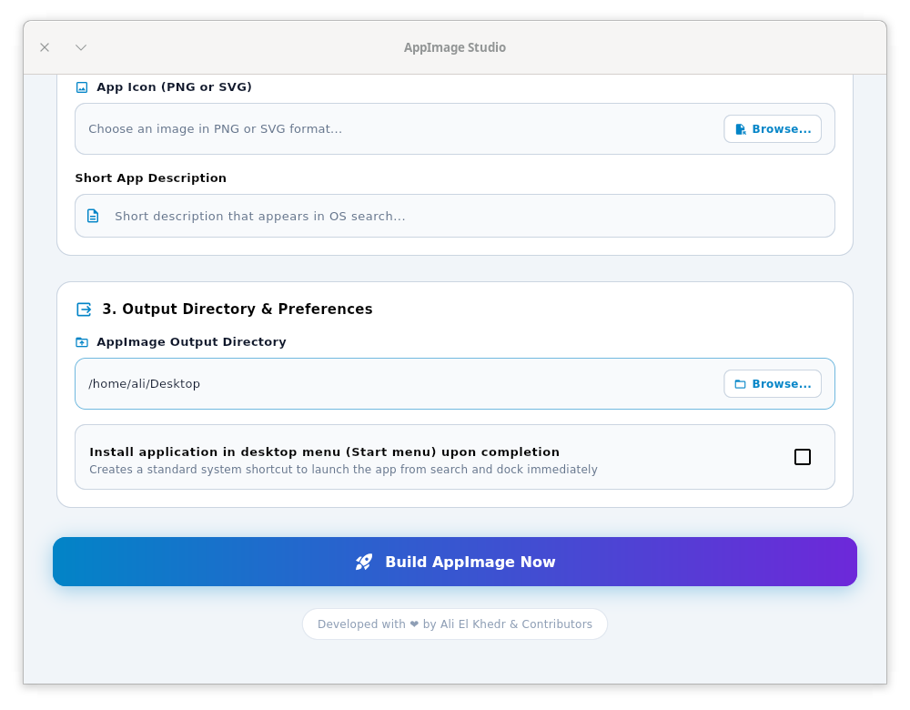
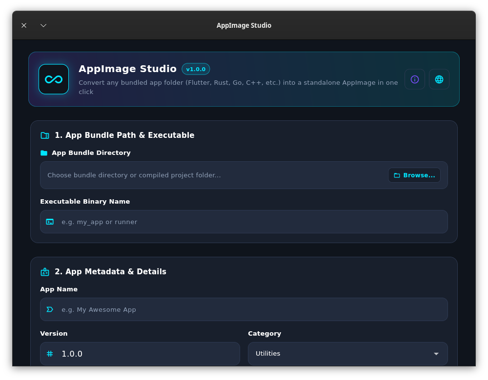
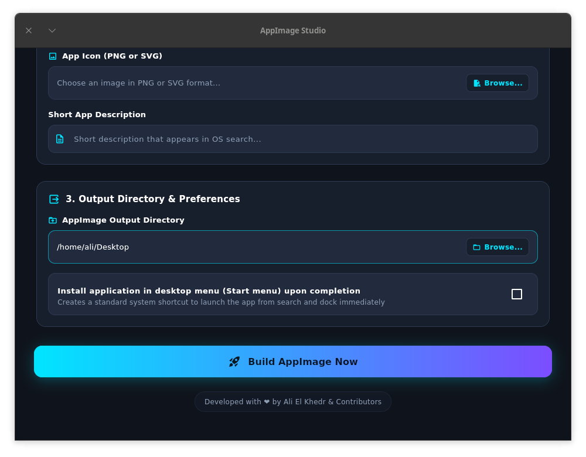
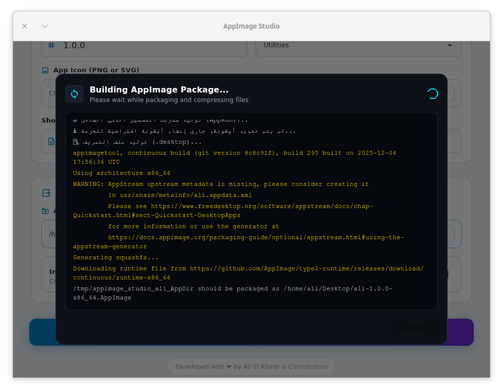
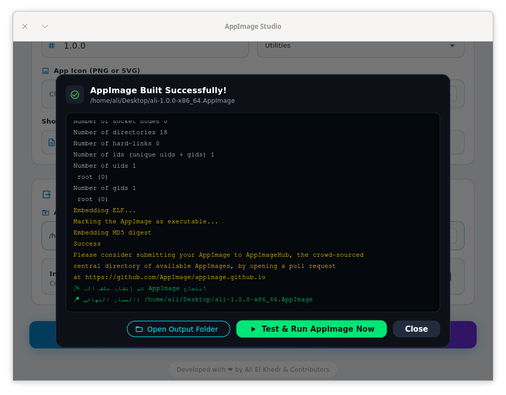

# 🚀 AppImage Studio | استوديو آب إيمج

<p align="center">
  
</p>

<p align="center">
  <strong>A modern, standalone desktop studio to package and distribute Linux applications as AppImages in one click.</strong><br />
  <em>أداة مكتبية حديثة ومستقلة لتغليف وتوزيع تطبيقات لينكس كحزم AppImage بنقرة زر واحدة.</em>
</p>

<p align="center">
  
  
  
  
</p>

<p align="center">
  <a href="#screenshots">📸 Screenshots / لقطات الشاشة</a> • 
  <a href="#english">🇬🇧 English</a> • 
  <a href="#arabic">🇸🇦 العربية</a> • 
  <a href="#compatibility">🐧 Compatibility / التوافق</a> • 
  <a href="#requirements">📋 Requirements / الشروط</a> • 
  <a href="#how-to-use">🛠️ How to Use / طريقة التشغيل</a> • 
  <a href="#resources">📖 Resources / المصادر</a>
</p>

---

<a name="screenshots"></a>
## 📸 Screenshots | لقطات من التطبيق

### 🎨 الواجهة الرئيسية (Main Screen)
| 🌙 **الوضع الداكن (Dark Mode)** | ☀️ **الوضع الفاتح (Light Mode)** |
| :---: | :---: |
|  <br> |  <br> |

<br />

### 🖥️ نافذة البناء المباشرة وسجل المعالجة (Live Build Console)
| ⏳ **أثناء البناء والضغط (Building Process)** | ✅ **اكتمال التحزيم بنجاح (Build Success)** |
| :---: | :---: |
|  |  |

---

<a name="english"></a>
## 🇬🇧 Overview

**AppImage Studio** simplifies the packaging and distribution of compiled desktop applications (Flutter, Rust, Go, C++, Python, Godot, Electron, etc.) as well as portable app folders for Linux. It eliminates the complexity of writing manual `.desktop` and `AppRun` files and allows both developers and everyday Linux users to turn portable software directories into standalone `.AppImage` files with optional one-click desktop menu integration.

### ✨ Key Features
- 🖱️ **One-Click Packaging**: Select your compiled bundle folder and build your `.AppImage` instantly.
- 💼 **Portable Single-File Apps**: Turn your programs into portable binaries that run directly from any folder or USB drive without requiring installation or root access.
- 🔍 **Smart Auto-Detection**: Automatically detects application names, executable binaries, and app icons.
- ⚡ **100% Offline-First**: Built-in `appimagetool` binary — works completely offline without network dependency.
- 🌐 **Multilingual & System Adaptive**: Full support for Arabic (RTL) and English (LTR) with automatic system language detection and instant switcher.
- 📌 **Optional Desktop Integration**: Option to install your newly built application into your system Start menu and dock immediately.
- 🖥️ **Live Build Console**: Real-time terminal output with smart error diagnostics and suggested fixes.
- 🧪 **One-Click Test Run**: Launch and test the generated `.AppImage` directly from the app.

---

<a name="arabic"></a>
## 🇸🇦 نظرة عامة بالعربية

**استوديو آب إيمج (AppImage Studio)** هو تطبيق ديسكتوب عصري ومفتوح المصدر يهدف إلى تسهيل تحويل مجلدات البرمجيات والمشاريع المجمّعة أو المحمولة (مثل تطبيقات فلاتر، رست، جو، بايثون، أو البرامج المحمولة كـ Blender و Telegram و VS Code) إلى حزم **AppImage** مستقلة وجاهزة للعمل على كافة توزيعات لينكس، مع إمكانية تثبيتها ودمجها مباشرة في قائمة "ابدأ" بنقرة واحدة وبدون الحاجة لكتابة أوامر.

### 🌟 أبرز الميزات:
- 📦 **تغليف فوري بنقرة واحدة**: اختر مجلد التطبيق المجمّع واضغط على زر التوليد ليصبح تطبيقك حزمة واحدة جاهزة.
- 💼 **إنشاء تطبيقات محمولة (Portable Apps)**: تحويل أي برنامج إلى ملف تنفيذي محمول مستقل، يمكنك نسخه إلى فلاش ميموري (USB) وتشغيله على أي حاسوب لينكس مباشرة دون تثبيت أو صلاحيات جذر.
- 🔍 **فحص واكتشاف ذكي تلقائي**: يتعرف التطبيق تلقائياً على اسم البرنامج، الملف التنفيذي الرئيسي، والأيقونة المناسبة.
- ⚡ **استقلالية تامة وبدون إنترنت (Offline-First)**: مدمج بـ `appimagetool` ليعمل في أي بيئة معزولة عن الشبكة بأمان كامل.
- 🌐 **دعم كامل للغتين العربية والإنجليزية**: واجهة تتكيف تلقائياً مع لغة نظامك مع دعم اتجاه اليمين لليسار (RTL) وزر تبديل فوري.
- 📌 **تكامل اختياري مع قائمة "ابدأ"**: خيار لتثبيت التطبيق المولد مباشرة في قائمة تطبيقات جهازك وشريط المهام.
- 🖥️ **نافذة طرفية تفاعلية مباشرة**: عرض خطوات البناء ومخرجات الضغط الحية مع تشخيص ذكي للأخطاء وتقديم حلول مقترحة.
- 🚀 **تجربة وتشغيل مباشر**: زر لتشغيل واختبار ملف الـ AppImage المولد فوراً.

---

<a name="compatibility"></a>
## 🐧 Supported Distributions & Compatibility | التوافق والتوزيعات المدعومة

### 🇬🇧 Compatibility & Supported Systems
Thanks to the continuous build pipeline on **Ubuntu 22.04 LTS (glibc 2.35)**, AppImage Studio is compatible with the vast majority of modern Linux distributions right out of the box:

- **Debian / Ubuntu Family:** Ubuntu (22.04, 24.04+), Debian (12 Bookworm, 13 Trixie), Linux Mint (21, 22), Pop!_OS, Zorin OS, Elementary OS.
- **Red Hat / Fedora Family:** Fedora (38, 39, 40, 41+), RHEL / CentOS Stream 9+.
- **Arch Family:** Arch Linux, Manjaro, EndeavourOS.
- **openSUSE Family:** openSUSE Leap 15.5+, Tumbleweed.

> [!NOTE]
> **FUSE Support on modern distros (Ubuntu 24.04+ / Debian 12+):**  
> If your system does not have FUSE installed by default (such as on a fresh Ubuntu 24.04 LTS), install it once with:
> ```bash
> # For Ubuntu 24.04 LTS:
> sudo apt install libfuse2t64
> 
> # For Ubuntu 22.04 / Debian 11/12:
> sudo apt install libfuse2
> ```
> Alternatively, you can use desktop app managers like **Gear Lever** or **AppImageLauncher**.

---

### 🇸🇦 التوافق والتوزيعات المناسبة
بفضل آلية البناء التلقائي المعتمدة على **Ubuntu 22.04 LTS (glibc 2.35)**، فإن التطبيق متوافق وجاهز للعمل مباشرة على معظم توزيعات لينكس الحديثة والشائعة:

- **عائلة دبيان وأوبونتو:** Ubuntu (22.04, 24.04+), Debian (12 Bookworm, 13 Trixie), Linux Mint (21, 22), Pop!_OS, Zorin OS, Elementary OS.
- **عائلة ريدهات:** Fedora (38, 39, 40, 41+), RHEL / CentOS Stream 9+.
- **عائلة آرتش:** Arch Linux, Manjaro, EndeavourOS.
- **عائلة أوبن سوزي:** openSUSE Leap 15.5+, Tumbleweed.

> [!NOTE]
> **ملاحظة مهمة لمستخدمي أوبونتو 24.04 (Ubuntu 24.04 LTS):**  
> لتشغيل أي حزمة AppImage على نظام Ubuntu 24.04 الحديث، تأكد من تثبيت مكتبة FUSE لمرة واحدة فقط عبر الأمر التالي:
> ```bash
> sudo apt install libfuse2t64
> ```
> ولتوزيعات أوبونتو 22.04 ودبيان: `sudo apt install libfuse2`

#### 💡 هل يعمل التطبيق على أي توزيعة بدون مكتبات إضافية؟
* **نعم بنسبة تتجاوز 95%**؛ حيث تحزم صيغة AppImage محرك Flutter وكافة الملفات والتبعيات داخل ملف تنفيذي واحد مستقل.
* **التوافق العالي مع الأنظمة (Backward Compatibility):** الاعتماد على بيئة `Ubuntu 22.04` يضمن تشغيل البرنامج على أي نظام صدر منذ عام 2022 وحتى أحدث الإصدارات الحالية دون أي تعارض في مكتبات النظام الأساسية (`glibc`).

---

<a name="requirements"></a>
## 📋 Input App Requirements | شروط التطبيقات القابلة للتحويل

### 🇬🇧 Requirements for Bundle Folders
To ensure seamless AppImage generation, the source folder must meet the following criteria:
1. **Linux Native Binary:** Must contain a compiled 64-bit Linux executable (`x86_64` ELF binary) or an executable shell script (`.sh`) — *not a Windows `.exe`*.
2. **Self-Contained Directory:** The folder should include all required application dependencies and assets (e.g., `bundle/` or `dist/` folders from Flutter, Rust, Go, or portable Linux apps).
3. **Relative Resource Paths:** The application should locate its internal data using relative paths rather than hardcoded absolute directories.
4. **App Icon (Optional):** Providing a square `PNG` or `SVG` icon (256x256+) is recommended. If missing, a default vector icon is generated automatically.

---

### 🇸🇦 شروط مجلد التطبيق المراد تحويله
لضمان نجاح عملية التغليف وعمل الـ AppImage بسلاسة:
1. **ملف تنفيذي مخصص للينكس:** يجب أن يحتوي المجلد على ملف تنفيذي مجمّع لنظام لينكس (`x86_64`) أو سكربت تشغيل (`.sh`) قابل للتنفيذ (*لا يدعم ملفات ويندوز `.exe`*).
2. **مجلد مكتفٍ ذاتياً:** يجب أن يضم المجلد ملف البرنامج الرئيسي ومكتباته وموارده التابعة له (مثل مجلدات `bundle` الناتجة عن Flutter، Rust، Go، أو مجلدات البرامج المحمولة).
3. **الاعتماد على مسارات نسبية:** ألا يعتمد البرنامج على مسارات ثابتة خاصة بجهاز المطور (Hardcoded Paths)، بل يبحث عن ملفاته نسبياً داخل مجلده.
4. **أيقونة التطبيق (اختياري):** يفضل توفير أيقونة مربعة بصيغة `PNG` أو `SVG`. وفي حال عدم توفرها، يولد التطبيق تلقائياً أيقونة بديلة عالية الجودة.

---

<a name="how-to-use"></a>
## 🛠️ How to Build & Run Locally | طريقة التشغيل والبناء

### Requirements | المتطلبات:
- Flutter SDK (>= 3.13.0)
- Linux Desktop Build Tools (`clang`, `cmake`, `ninja-build`, `pkg-config`, `libgtk-3-dev`)

### Running in Development | التشغيل في وضع التطوير:
```bash
flutter pub get
flutter run -d linux
```

### Packaging AppImage Studio as an AppImage | بناء وتغليف التطبيق نفسه:
```bash
./scripts/build_appimage.sh
```
The resulting `.AppImage` will be located in `dist/AppImageStudio-x86_64.AppImage`.

---

<a name="resources"></a>
## 📖 Article & Resources | الشرح والمصادر
- 📝 **Full Detailed Article on Blog | مقال الشرح التفصيلي على المدونة:** [alielkhedr.com - AppImage Studio](https://www.alielkhedr.com/2026/09/appimage-studio.html)
- 🌐 **Developer Website | الموقع الشخصي للمطور:** [alielkhedr.com](https://alielkhedr.com)

---

## 🗺️ Roadmap & Vision | خارطة الطريق والرؤية
For detailed architectural principles, feature matrix, and upcoming release plans, check out our [**ROADMAP.md**](docs/ROADMAP.md).  
*للاطلاع على المبادئ المعمارية وخطة الميزات للإصدارات القادمة، راجع وثيقة [خارطة الطريق](docs/ROADMAP.md).*

---

## 📜 License | الترخيص
This project is open source and available under the **GNU General Public License v3.0 (GPLv3)**.  
*تم تطوير هذا المشروع بشغف لخدمة مجتمع لينكس والمطورين مفتوح المصدر بموجب رخصة GNU GPLv3.*  
Copyright © 2026 [Ali El Khedr](https://alielkhedr.com). All rights reserved.
